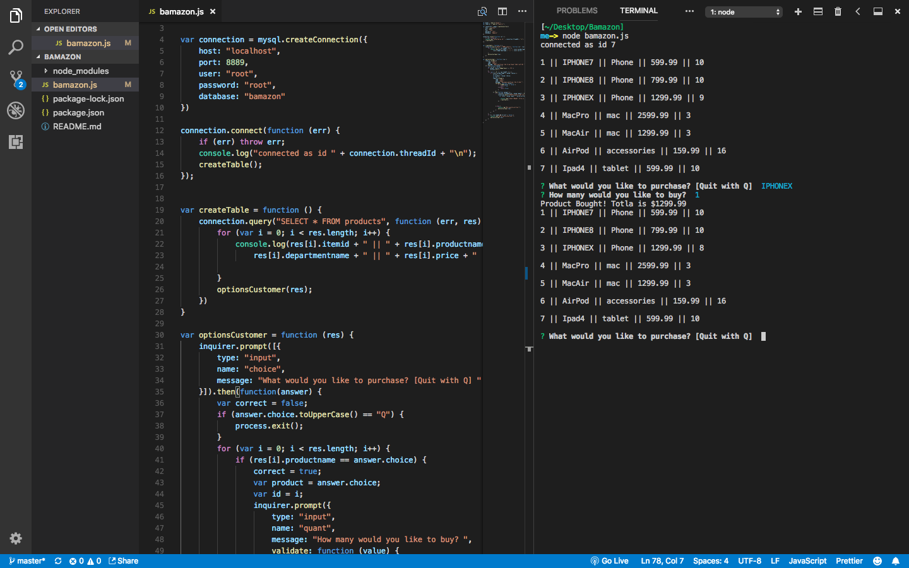
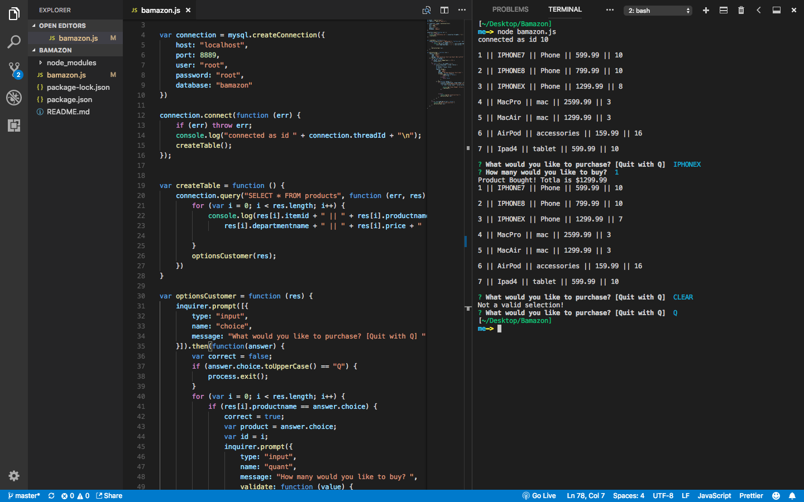

# Bamazon

💥 BAMazon 💻 📦
Overview
A Node.js & MySQL digital storefront. This is a command line Node app that mimics a beloved online retailer.

Node.js
Three JavaScript files replicate the basics of a simple ecommerce engine:

BamazonCustomer.js (See example here)

Receives orders from customers via the command line and interfaces with mySQL to deplete stock from the store's inventory.
BamazonManager.js (See example here)

Mimics the basics of a warehouse management system, providing managers with a list of options to view stock and adjust inventory.
A sample of the menu is below:
View Products for Sale
View Low Inventory
Add to Inventory
Add New Product

